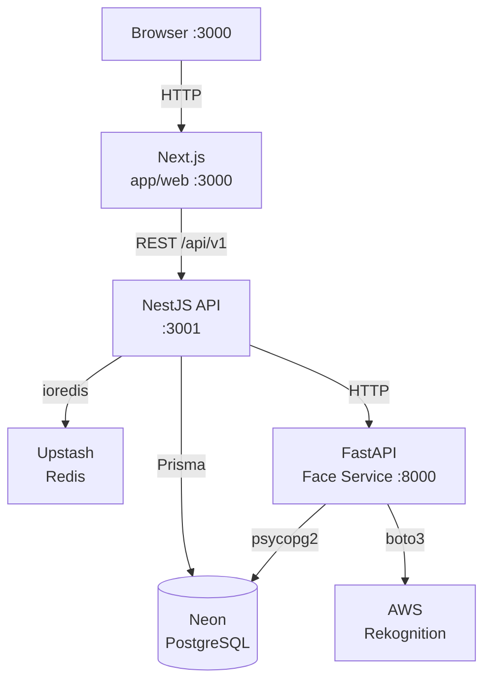
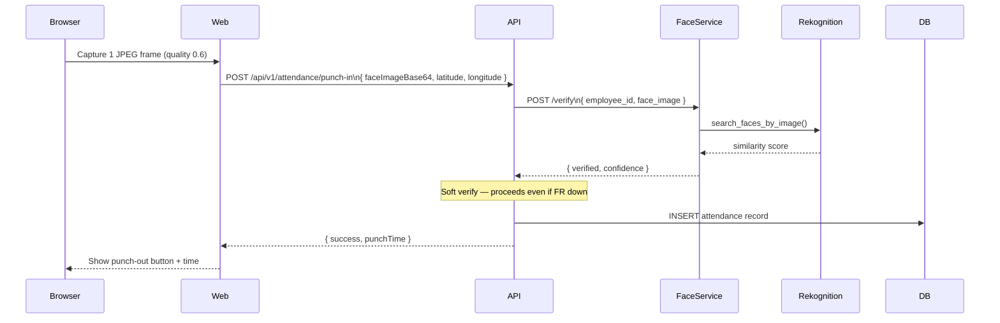

# Architecture & Services

← [[NexGen EMS - Overview|Overview]]

---

## Monorepo Structure

```
nexgen-ems/
├── apps/
│   ├── api/              NestJS REST API          → :3001
│   ├── web/              Next.js frontend          → :3000
│   └── face-service/     FastAPI face recognition  → :8000
├── packages/
│   ├── db/               Prisma schema + client
│   └── types/            Shared TypeScript types
├── docker-compose.yml
└── render.yaml           Cloud deploy blueprint
```

---

## Service Map



---

## Service Details

### Next.js Web (`apps/web`)
- **Port:** 3000
- **Output:** `standalone` (Docker-ready)
- **API env var:** `NEXT_PUBLIC_API_URL` — baked at build time
- **Key pages:**
  - `/` → Login
  - `/(app)/dashboard` → Dashboard
  - `/(app)/attendance` → Punch in/out with face scan
  - `/(app)/attendance/biometric` → Face enrollment
  - `/(app)/leaves` → Leave requests
  - `/(app)/expenses` → Expense claims

### NestJS API (`apps/api`)
- **Port:** 3001
- **Prefix:** `/api/v1`
- **Health check:** `GET /health`
- **Swagger docs:** `/api/docs`
- **Body limit:** 20 MB (base64 face images)
- **Key modules:** `auth`, `employees`, `attendance`, `leaves`, `expenses`, `salary`, `reports`

### FastAPI Face Service (`apps/face-service`)
- **Port:** 8000
- **Provider:** AWS Rekognition (replaced DeepFace)
- **Endpoints:**
  - `POST /enroll` — index face into Rekognition collection
  - `POST /verify` — search face against collection
  - `GET /health` — liveness probe
- **Collection:** `nexgen-employees` (auto-created on first enroll)

---

## Data Flow — Punch In



---

## Database (Neon PostgreSQL)

- **Pooled URL** (API): `ep-mute-meadow-ao8beta1-pooler...` — pgBouncer pooling
- **Direct URL** (face-service / migrations): `ep-mute-meadow-ao8beta1...` — no pooling
- **Face data storage:** `employees.face_embedding` (JSONB) stores `{"rekognition_face_id": "uuid"}`
- **Face enrolled flag:** `employees.face_enrolled` (BOOLEAN)

> [!note] Why two URLs?
> pgBouncer (pooled) doesn't support Prisma's prepared statements for migrations, and psycopg2 doesn't support `channel_binding=require`. The direct URL is used for both.

---

## Ports at a Glance

| Service | Local Port | Notes |
|---------|-----------|-------|
| Next.js web | 3000 | |
| NestJS API | 3001 | |
| FastAPI face | 8000 | |
| PostgreSQL (Docker only) | 5433 | maps to container :5432 |
| Redis (Docker only) | 6380 | maps to container :6379 |
