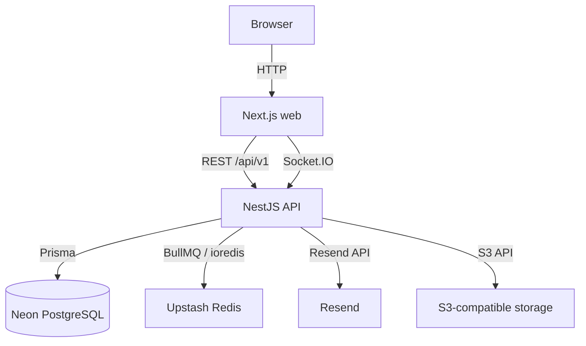
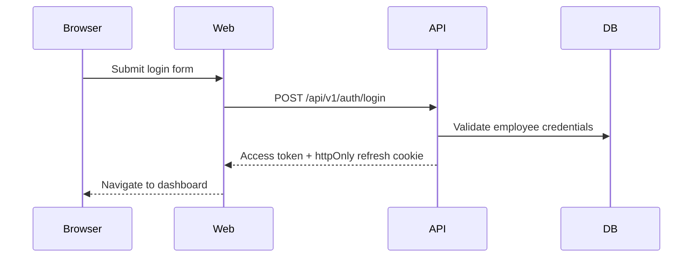
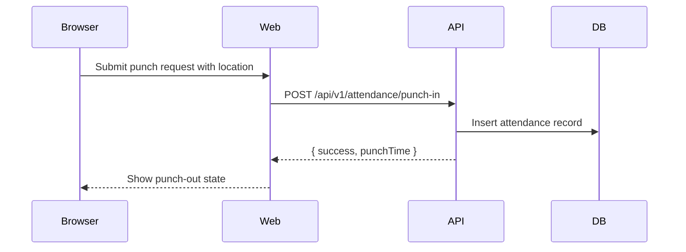

# Architecture & Services

## Monorepo Structure

```text
nexgen-ems/
├── apps/
│   ├── api/        NestJS REST API
│   └── web/        Next.js frontend
├── packages/
│   ├── db/         Prisma schema + client
│   └── types/      Shared TypeScript types
├── docker-compose.yml
└── railway.json
```

## Service Map



## Service Details

### Next.js Web (`apps/web`)

- Vercel frontend project
- Public API env var: `NEXT_PUBLIC_API_URL`
- `NEXT_PUBLIC_API_URL` must be the API origin only, without `/api/v1`
- Key pages include login, dashboard, attendance, leaves, expenses, salary, reports, and management views

### NestJS API (`apps/api`)

- Vercel backend project
- API prefix: `/api/v1`
- Health check: `GET /health`
- Swagger docs: `/api/docs`
- Key modules: `auth`, `employees`, `attendance`, `leaves`, `expenses`, `salary`, `reports`, `notifications`

The old face recognition service has been removed from the active deployment.

## Data Flow - Login



## Data Flow - Punch In



## Database

- Runtime API connection: Neon pooled connection string in `DATABASE_URL`
- Prisma migration/generate connection: Neon direct connection string in `DIRECT_URL`

> pgBouncer pooled URLs do not support Prisma migration behavior reliably. Use
> `DIRECT_URL` for migrations and `DATABASE_URL` for runtime.

## Production Ports

Vercel provides public HTTPS origins for both apps. Local development commonly
uses:

| Service | Local Port |
|---------|------------|
| Next.js web | 3000 |
| NestJS API | 3001 |
| PostgreSQL (Docker only) | 5433 |
| Redis (Docker only) | 6380 |
